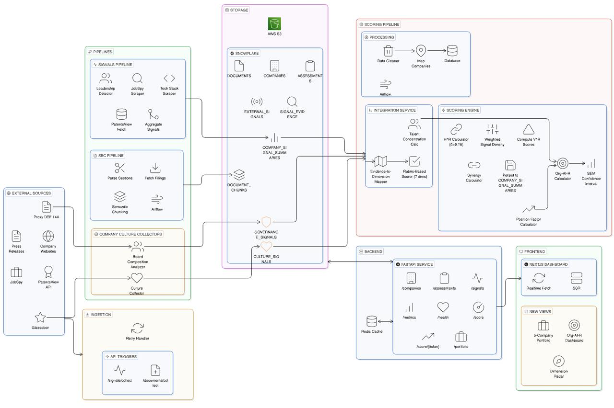

# PE Org-AI-R Platform 🚀
> **Enterprise-Grade Intelligence Engine for Private Equity AI Due Diligence**


The **PE Org-AI-R Platform** is a sophisticated data orchestration and analytics platform engineered to help Private Equity firms assess the technological maturity and AI readiness of target portfolio companies. The system automates the capture of high-fidelity signals from SEC filings, global patent registries, technology job markets, and **Glassdoor employee reviews** to compute a multi-dimensional AI-readiness score.

---

## 🛠 Technology Stack & Core Dependencies

| Layer | Technologies & Frameworks |
| :--- | :--- |
| **Frontend** |  **Next.js 15 (App Router)**, **TypeScript**, **Tailwind CSS**, **Lucide React** |
| **Backend** |  **FastAPI**, **Pydantic V2**, **Structured Logging (structlog)**, **Tenacity (Retry Logic)** |
| **Data & Cache** |  **Snowflake (SQL Alchemy + Snowflake-connector)**,  **Redis (aioredis)** |
| **Orchestration** |  **Apache Airflow 2.x** (TaskFlow API, Dynamic Task Mapping) |
| **Pipelines** |  **Playwright (Stealth Mode)**, **JobSpy (LinkedIn Scraper)**, **Wextractor (Glassdoor API)**, **Boto3 (AWS S3)** |
| **Reverse Proxy** |  **Nginx** (unified gateway for API + Frontend + Docs) |
| **Testing** |  **Pytest**, **Asyncio In-Memory Testing** |

---

## 📚 Documentation & Resources
*   **Codelabs Guide**: [Detailed Step-by-Step Walkthrough](https://codelabs-preview.appspot.com/?file_id=1z3QNIXveTzj0-KyBfuS46IGHTSKYBC2cAkpQrPN1ALQ#0)
*   **Codelab Documentation**: [Project Technical Manual](https://docs.google.com/document/d/1z3QNIXveTzj0-KyBfuS46IGHTSKYBC2cAkpQrPN1ALQ/edit?tab=t.0)
*   **Architecture Diagram**:
    
*   **Video Demonstration**: [Full Platform Walkthrough](https://drive.google.com/file/d/1KJ-JuXoVbiEB0IHeeLY3EPvKNikRtyoZ/view?usp=sharing)

---

## 📂 Project Structure
```text
.
  |docker
  |--|Dockerfile
  |--|docker-compose.yml
  |--|nginx.conf                      # Nginx reverse proxy config
  |--|dags/                           # Airflow DAG mount point
  |--|logs/                           # Airflow log volume
  |--|plugins/                        # Airflow plugins mount
  |dags
  |--|integration_pipeline_dag.py     # Full scoring pipeline (daily)
  |--|sec_ingestion_dag.py            # SEC filing ingestion (daily)
  |--|sec_backfill_dag.py             # SEC backfill (manual trigger)
  |--|sec_monitor_dag.py              # SEC data quality audit (weekly)
  |app
  |--|routers
  |--|--|metrics.py                   # Dashboard & readiness report metrics
  |--|--|signals.py                   # External signals & Glassdoor endpoints
  |--|--|routers_utils.py
  |--|--|config.py
  |--|--|health.py                    # Dependency health checks
  |--|--|__init__.py
  |--|--|sec.py                       # SEC document & Airflow trigger endpoints
  |--|--|companies.py                 # Company CRUD & evidence lookup
  |--|--|testing.py                   # In-API pytest runner
  |--|--|assessments.py               # Assessment lifecycle & dimension scores
  |--|--|evidence.py                  # Batch collection & backfill
  |--|--|industries.py
  |--|--|integration.py               # Integration pipeline trigger (direct + Airflow)
  |--|database
  |--|--|seed.sql
  |--|--|schema.sql
  |--|--|schema_sec.sql
  |--|--|schema_signal.sql
  |--|--|schema_culture.sql            # Glassdoor culture scores
  |--|--|__init__.py
  |--|config.py
  |--|__init__.py
  |--|pipelines
  |--|--|integration_pipeline.py       # Master integration orchestrator
  |--|--|board_analyzer.py             # Board composition analyzer
  |--|--|sec
  |--|--|--|pipeline.py
  |--|--|--|downloader.py
  |--|--|--|parser.py
  |--|--|--|chunker.py
  |--|--|--|components.py              # Airflow-compatible task components
  |--|--|glassdoor
  |--|--|--|__init__.py
  |--|--|--|glassdoor_collector.py      # Review fetcher & rubric scorer
  |--|--|--|glassdoor_orchestrator.py   # Batch orchestration & persistence
  |--|--|--|glassdoor_queries.py        # Snowflake query templates
  |--|--|external_signals
  |--|--|--|orchestrator.py
  |--|--|--|job_collector.py
  |--|--|--|patent_collector.py
  |--|--|--|tech_stack_collector.py
  |--|--|--|leadership_collector.py
  |--|--|--|utils.py
  |--|logging_conf.py
  |--|models
  |--|--|assessment.py
  |--|--|signals.py
  |--|--|enums.py
  |--|--|company.py
  |--|--|registry.py
  |--|--|__init__.py
  |--|--|common.py
  |--|--|sec.py
  |--|--|industry.py
  |--|--|dimension.py
  |--|--|scoring.py                    # Scoring result models
  |--|--|glassdoor_models.py           # Glassdoor review models
  |--|--|board.py                      # Board composition models
  |--|scoring                          # AI Readiness Scoring Engine
  |--|--|__init__.py
  |--|--|rubric_scorer.py              # Rubric-based scoring logic
  |--|--|calculators.py                # VR, HR, Synergy, Confidence, OrgAIR
  |--|--|evidence_mapper.py            # Signal → Dimension evidence mapping
  |--|--|talent_analyzer.py            # Talent concentration analysis
  |--|--|position_factor.py            # Position-factor calculator
  |--|--|utils.py
  |--|main.py
  |--|services
  |--|--|__init__.py
  |--|--|backfill.py                   # Evidence backfill service
  |--|--|snowflake.py
  |--|--|s3_storage.py
  |--|--|redis_cache.py
  |--|--|sector_config.py              # Sector/industry configuration
  |pytest.ini
  |frontend
  |--|postcss.config.mjs
  |--|Dockerfile
  |--|README.md
  |--|public
  |--|package.json
  |--|tsconfig.json
  |--|next.config.ts
  |--|src
  |--|--|app
  |requirements.txt
  |pyproject.toml
  |tests
  |--|conftest.py
  |--|test_api.py                      # REST endpoint validation
  |--|test_flows.py                    # Assessment → Signal → Score lifecycle
  |--|test_models.py                   # Pydantic V2 model validation
  |--|test_concurrency.py              # Parallel scraping stress tests
  |--|test_performance_cache.py        # Redis hit rates & latency
  |--|test_sec_downloader.py           # SEC/PatentsView mock tests
  |--|test_scoring_properties.py       # Scoring engine property tests
  |--|test_assessments_router.py       # Assessment router tests
  |--|test_backfill_mock.py            # Backfill service mock tests
  |--|test_cs3_calculators.py          # CS3 scoring calculator tests
  |--|test_integration_pipeline.py     # Integration pipeline tests
  |--|test_redis_mock.py               # Redis mock tests
  |--|test_router_coverage.py          # Full router coverage tests
  |--|test_rubrics.py                  # Rubric scoring tests
  |--|test_s3_mock.py                  # S3 storage mock tests
  |--|test_snowflake_mock.py           # Snowflake mock tests
  |--|test_coverage_expansion.py       # General coverage expansion
  |README.md
  |logs
  |--|app.log
  |data
  |--|sec_downloads
  |--|README.md
```

---

## 🚀 Deployment & Installation

### 1. Requirements & Prerequisites
*   **Docker Desktop** (with Compose V2)
*   **Snowflake Account** (With `ACCOUNTADMIN` or equivalent to create tables)
*   **AWS S3 Bucket** (Optional: for unstructured filing storage)
*   **PatentsView API Key** (Optional: for innovation activity signals)
*   **Wextractor API Key** (Optional: for Glassdoor review collection)

### 2. Environment Setup
Configure your `.env` file in the root directory:

```bash
# === Snowflake Settings ===
SNOWFLAKE_ACCOUNT="your-org-your-account"
SNOWFLAKE_USER="your-user"
SNOWFLAKE_PASSWORD="your-password"
SNOWFLAKE_DATABASE="PE_ORGAIR"
SNOWFLAKE_SCHEMA="PUBLIC"
SNOWFLAKE_WAREHOUSE="your-warehouse"
SNOWFLAKE_ROLE="ACCOUNTADMIN"

# === Application ===
SECRET_KEY="your-secret-key"
AIRFLOW_UID=501

# === Infrastructure ===
REDIS_HOST="redis"
NEXT_PUBLIC_API_URL="http://localhost:8000"

# === External Integration (Optional) ===
AWS_ACCESS_KEY_ID="your-key"
AWS_SECRET_ACCESS_KEY="your-secret"
AWS_REGION="us-east-1"
S3_BUCKET="pe-intelligence-parsed"
PATENTSVIEW_API_KEY="your-patentsview-key"
WEXTRACTOR_API_KEY="your-wextractor-key"
```

### 3. Build and Launch
```bash
docker compose --env-file .env -f docker/docker-compose.yml up --build
```

All services are accessible through **Nginx reverse proxy** on a single port:

*   **Platform (Unified Entry)**: `http://localhost` — Nginx routes to the appropriate service
*   **Interactive API Docs (Swagger)**: `http://localhost/docs`
*   **Airflow UI**: `http://localhost:8080`

> **Nginx Routing Rules:**
> | Path | Routed To |
> | :--- | :--- |
> | `/api/*` | FastAPI backend (`:8000`) |
> | `/docs`, `/openapi.json` | Swagger/OpenAPI UI (`:8000`) |
> | `/*` (everything else) | Next.js frontend (`:3000`) |

### 4. Docker Services Architecture

The platform runs as a **multi-container stack** orchestrated by Docker Compose:

| Service | Image / Build | Exposed Port | Purpose |
| :--- | :--- | :--- | :--- |
| **nginx** | `nginx:latest` | `:80` | Reverse proxy — single entry point for all traffic |
| **api** | Custom (Airflow base) | Internal `:8000` | FastAPI backend with all REST endpoints |
| **frontend** | Custom (Next.js) | Internal `:3000` | Next.js 15 frontend application |
| **airflow-webserver** | Custom (Airflow base) | `:8080` | Airflow UI for DAG management |
| **airflow-scheduler** | Custom (Airflow base) | — | DAG scheduling & task execution |
| **airflow-triggerer** | Custom (Airflow base) | — | Deferred task triggering |
| **postgres** | `postgres:13` | — | Airflow metadata database |
| **redis** | `redis:latest` | — | Caching layer & Airflow broker |

### 5. Stopping and Cleanup

**Stop containers and remove images (Recommended):**
```bash
# Stops containers and removes images to free disk space
docker compose --env-file .env -f docker/docker-compose.yml down --rmi all
```
> **Note:** This preserves your data in `./data/` and `./logs/` directories.

**Complete cleanup (includes volumes):**
```bash
# ⚠️ WARNING: This removes Redis data, Airflow metadata, and all volumes
docker compose --env-file .env -f docker/docker-compose.yml down --rmi all --volumes
```

**Periodic maintenance (recommended weekly):**
```bash
# Clean up unused Docker resources
docker system prune -a -f
docker builder prune -f
```

**Check disk usage:**
```bash
# View Docker disk usage
docker system df

# Check data folder size
du -sh data/ logs/
```

---

## 📡 API Reference

The platform exposes a comprehensive REST API via **FastAPI** with 11 routers. Full interactive documentation is available at **`http://localhost/docs`** (Swagger UI) and **`http://localhost/openapi.json`** (OpenAPI spec).

### Endpoint Overview

| Router | Prefix | Endpoints | Description |
| :--- | :--- | :--- | :--- |
| **Health** | `/health` | `GET /health` | Dependency health check (Snowflake, Redis, S3 status) |
| **Companies** | `/api/v1/companies` | `POST /` `GET /` `GET /{id}` `PUT /{id}` `DELETE /{id}` `GET /{id}/signals/{category}` `GET /{id}/evidence` | Full CRUD, per-company signals by category, and evidence lookup |
| **Assessments** | `/api/v1` | `POST /assessments` `GET /assessments` `GET /assessments/{id}` `PATCH /assessments/{id}/status` `POST /assessments/{id}/scores` `GET /assessments/{id}/scores` `PUT /scores/{id}` | Assessment lifecycle management with dimension scoring |
| **SEC Documents** | `/api/v1/documents` | `POST /collect` `POST /collect-airflow` `GET /` `GET /{id}` `GET /{id}/chunks` | SEC filing collection (direct + Airflow trigger), document & chunk retrieval |
| **Signals** | `/api/v1/signals` | `POST /collect/glassdoor` `GET /culture/{ticker}` `GET /culture/reviews/{ticker}` `POST /collect` `GET /` `GET /evidence` `GET /summary` `GET /details/{category}` | External intelligence collection, Glassdoor reviews & culture scores, signal browsing |
| **Evidence** | `/api/v1/evidence` | `POST /collect` `POST /backfill` `GET /stats` | Batch evidence collection, full portfolio backfill, progress stats |
| **Integration** | `/api/v1/integration` | `POST /run` `POST /run-airflow` | Deep scoring pipeline (direct execution or Airflow DAG trigger) |
| **Metrics** | `/api/v1/metrics` | `GET /industry-distribution` `GET /company-stats` `GET /signal-distribution` `GET /summary` `GET /readiness-report` | Dashboard analytics & AI readiness leaderboard |
| **Industries** | `/api/v1/industries` | `GET /` | List supported industries with risk factors |
| **Config** | `/api/v1/config` | `GET /vars` `GET /dimension-weights` | Non-sensitive platform configuration & scoring dimension weights |
| **System Testing** | `/api/v1/system` | `POST /run-tests` | Trigger the full pytest suite from the API and return results |

### Airflow DAG Trigger Endpoints

The API provides **programmatic access** to trigger Airflow DAGs without using the Airflow UI:

| Endpoint | DAG Triggered | Description |
| :--- | :--- | :--- |
| `POST /api/v1/documents/collect-airflow` | `sec_filing_ingestion` | Triggers SEC filing download, parsing, and Snowflake persistence |
| `POST /api/v1/integration/run-airflow` | `integration_pipeline` | Triggers the full OrgAIR scoring pipeline per ticker via Airflow |

Both endpoints communicate with the Airflow REST API internally and return the `dag_run_id` for tracking.

---

## 🔄 Airflow Pipeline Orchestration

The platform uses **Apache Airflow 2.x** with the **TaskFlow API** and **Dynamic Task Mapping** to orchestrate all data collection and scoring pipelines. Airflow runs as part of the Docker Compose stack alongside the API and frontend.

### DAG Overview

| DAG ID | Schedule | API Trigger | Description |
| :--- | :--- | :--- | :--- |
| `integration_pipeline` | `@daily` | `POST /api/v1/integration/run-airflow` | **Core scoring pipeline** — fetches active tickers, then for each company runs parallel analysis tasks (SEC rubric, Board composition, Talent signals, Culture/Glassdoor) and computes the final OrgAIR score. |
| `sec_filing_ingestion` | `@daily` | `POST /api/v1/documents/collect-airflow` | **SEC ingestion** — downloads latest 10-K/10-Q filings per ticker from EDGAR, parses and chunks documents, stores in S3 + Snowflake. |
| `sec_backfill` | Manual | — | **SEC backfill** — manually triggered to backfill historical filings for specified tickers with configurable filing types and limits. |
| `sec_quality_monitor` | `@weekly` | — | **Data quality audit** — validates Snowflake document/chunk counts, checks S3 consistency, and flags zero-chunk documents (parsing failures). |

### Integration Pipeline Workflow
```
fetch_tickers ──► [Per Company (Dynamic Map)] ──►
                   ├── init_assessment
                   ├── analyze_sec       ─┐
                   ├── analyze_board      ├──► finalize_score
                   ├── analyze_talent     │
                   └── analyze_culture   ─┘
```

Each analysis stage runs in **parallel** within a mapped `task_group`. The `finalize_score` task uses `TriggerRule.ALL_DONE` to gracefully handle partial failures and still compute a score from available dimensions.

### SEC Ingestion Workflow
```
get_tickers ──► download_filings (mapped) ──► discover_filings ──► process_filing (mapped) ──► save_to_snowflake (mapped) ──► cleanup
```

Filings are downloaded, parsed into structured chunks, and persisted to Snowflake. Heavy XCom payloads are written to a shared volume instead of the Airflow metadata DB for efficiency.

---

## 🏢 Glassdoor Culture Scoring

The platform incorporates **Glassdoor employee reviews** as a cultural signal dimension for AI-readiness assessment. Reviews are collected via the **Wextractor API**, scored using a **keyword-based rubric**, and aggregated with **recency and employment-status weighting**.

### Review Collection
*   Reviews are fetched from Glassdoor for target companies (e.g., NVDA, JPM, WMT, GE, DG) using the Wextractor API.
*   Raw review JSON is **cached in S3** to avoid redundant API calls during re-runs.
*   Parsed review objects include: rating, title, pros/cons text, review date, and employment status.

### Rubric-Based Scoring
The `RubricScorer` evaluates reviews across **three culture dimensions**, each scored 1–5:

| Dimension | What It Measures | Example Positive Keywords | Example Negative Keywords |
| :--- | :--- | :--- | :--- |
| **Innovation** | Creativity & forward-thinking culture | *"cutting-edge"*, *"encourages new ideas"*, *"creative freedom"* | *"resistant to change"*, *"outdated tools"*, *"bureaucratic"* |
| **Leadership** | Quality of management vision & support | *"empowering leadership"*, *"clear vision"*, *"mentorship"* | *"micromanagement"*, *"poor communication"*, *"no direction"* |
| **Adaptability** | Organizational agility & responsiveness | *"fast-paced"*, *"embraces change"*, *"agile processes"* | *"slow decision-making"*, *"rigid structure"*, *"stagnant"* |

### Weighted Aggregation
Scores are **not simple averages** — each review is weighted by two factors:
1.  **Recency Weight**: More recent reviews are weighted higher to reflect current company culture.
2.  **Employment Status**: Reviews from current employees carry different weight than former employees.

The final per-dimension score is computed as a **weighted average**, and keyword evidence is extracted and stored alongside scores for audit transparency.

### Data Storage
*   Scores are persisted to Snowflake using the `schema_culture.sql` schema.
*   The `glassdoor_queries.py` module contains `MERGE INTO` statements to handle upserts and prevent duplication.
*   Evidence keywords and review metadata are stored for downstream explainability in the frontend dashboards.

---

## ⚙️ Data Pipelines & Orchestration Logic

The system utilizes a multi-stage, asynchronous pipeline architecture designed for resilience and rate-limit compliance.

### **Pipeline Execution Flow**
The `IntegrationPipeline` orchestrates collection in a specific order to optimize data dependency:
1.  **Job Market Analysis**: First pass using **JobSpy** to identify AI hiring signals. This data is cached and used to resolve technical domains in step 2.
2.  **Concurrent Collection**:
    *   **Innovation Sweep**: Parallel fetch from **PatentsView API**.
    *   **Digital Presence**: Concurrent scan of `BuiltWith` and direct site signatures using **Playwright**.
    *   **Leadership Signals**: Scanning for C-suite AI focus.
3.  **Culture Analysis**: **Glassdoor reviews** are fetched, scored via the rubric engine, and persisted with weighted aggregation.
4.  **Scoring Finalization**: All dimension signals are fed into the **OrgAIR Scoring Engine** (VR, HR, Synergy, Confidence calculators) to produce the final composite score.

### **Robustness & Anti-Blocking Strategies**
To ensure uninterrupted operation and avoid IP/Rate-limit blocking, we implemented:
*   **Adaptive Rate Limiting**: The `PatentCollector` uses a custom `AsyncRateLimiter` capped at **45 req/min** to align with PatentsView quotas.
*   **Browser Stealth**: Playwright instances utilize `playwright-stealth` and **User-Agent rotation** to bypass basic bot detection on corporate websites.
*   **Interval Spacing**: SEC and Job pipelines include `asyncio.sleep` (200ms to 2s) between requests to avoid burst-detection.
*   **Retry Mechanisms**: All critical external calls are wrapped with **Exponential Backoff** using the `Tenacity` library.

### **Asynchronous Scalability**
*   **Semaphore Throttling**: The system uses `asyncio.Semaphore(5)` to prevent overwhelming Snowflake connection pools or external APIs.
*   **Non-Blocking Parsing**: Heavy CPU tasks (like parsing 50MB SEC text filings) are delegated to a `ThreadPoolExecutor` to keep the main API event loop responsive.

---

## 📐 Key Design Decisions

### **Single Source of Truth (SSOT)**
Consolidated legacy disjointed tables into a unified `companies` schema. This allows the SEC pipeline to dynamically "anchor" discovered CIKs to existing targets, ensuring a single version of the truth for every portfolio company.

### **Singleton Database Pattern**
Implemented a thread-safe **Snowflake Singleton** manager with a persistent session pool. This reduces API latency by avoiding the heavy SSL handshake required for new Snowflake connections on every request.

### **Graceful Degradation**
Integrations like S3 and PatentsView are designed to fail gracefully. If credentials are missing, the system warns the operator via structured logs but continues to serve existing data and other active collectors.

### **Airflow-Native Task Design**
Each pipeline step is wrapped as an Airflow `@task` with `asyncio.run()` bridging, allowing reuse of the existing async codebase. Dynamic Task Mapping (`expand()`) enables per-ticker parallelism without manual DAG construction.

---

## 🧪 Quality & Verification

The platform maintains a comprehensive test suite with **17 test modules** covering core logic, API integrity, service mocks, and performance benchmarks.

### Running Tests
Execute the full suite within the containerized environment:
```bash
# Run all tests
docker compose --env-file .env -f docker/docker-compose.yml exec api pytest -v -s
```

Alternatively, trigger tests directly from the API:
```bash
curl -X POST http://localhost/api/v1/system/run-tests
```

### Test Categories
| Module | Focus Area |
| :--- | :--- |
| **API Integrity** (`test_api.py`) | Validates REST endpoints, status codes, and payload validation. |
| **Business Logic** (`test_flows.py`) | End-to-end verification of the Assessment → Signal → Score lifecycle. |
| **Concurrency** (`test_concurrency.py`) | Stress tests parallel scraping tasks and semaphore throttling. |
| **Performance** (`test_performance_cache.py`) | Measures Redis hit rates and latency improvements for cached metrics. |
| **External Systems** (`test_sec_downloader.py`) | Mocks SEC/PatentsView interactions to ensure resilient parsing logic. |
| **Schema Integrity** (`test_models.py`) | Deep validation of Pydantic V2 models and data transformation rules. |
| **Scoring Properties** (`test_scoring_properties.py`) | Property-based tests for scoring engine calculators (VR, HR, Synergy, Confidence). |
| **Assessment Router** (`test_assessments_router.py`) | Assessment CRUD and status transition validation. |
| **Backfill Service** (`test_backfill_mock.py`) | Backfill service orchestration with mocked external dependencies. |
| **CS3 Calculators** (`test_cs3_calculators.py`) | Case Study 3 scoring calculator unit tests. |
| **Integration Pipeline** (`test_integration_pipeline.py`) | End-to-end integration pipeline execution tests. |
| **Redis Mocks** (`test_redis_mock.py`) | Redis caching behavior with mocked Redis client. |
| **Router Coverage** (`test_router_coverage.py`) | Comprehensive coverage across all API routers. |
| **Rubric Scoring** (`test_rubrics.py`) | Glassdoor rubric scorer keyword matching and dimension scoring. |
| **S3 Storage** (`test_s3_mock.py`) | S3 storage operations with mocked AWS client. |
| **Snowflake** (`test_snowflake_mock.py`) | Snowflake database operations with mocked connections. |
| **Coverage Expansion** (`test_coverage_expansion.py`) | General coverage expansion for edge cases. |

### Continuous Validation
The test suite is designed to be run as part of a CI/CD pipeline, ensuring that changes to the `IntegrationPipeline` do not regress scoring accuracy or rate-limit compliance.

---

## ⚠️ Known Limitations

1.  **Snowflake Constraints**: Unique constraints are metadata-only in Snowflake; duplication is prevented via `MERGE INTO` logic in our DAO layer.
2.  **BuiltWith Rendering**: Certain high-security sites may occasionally block the Playwright scan; the system falls back to job description keyword analysis in these scenarios.
3.  **Glassdoor API Quotas**: The Wextractor API has rate limits; reviews are cached in S3 to minimize redundant calls during pipeline re-runs.

---

## 👥 Team & Contributions

| Member | Contributions |
| :--- | :--- |
| **Aakash** | Base API (Models, Routers, Redis Caching), Signals Pipeline, Frontend (Tutorial, Playground) |
| **Rahul** | Base API (Models, Router, Schemas, AWS), SEC EDGAR Pipeline and Optimization, Frontend (Dashboards) |
| **Abhinav** | Base API (Models, Routers, Docker, Snowflake), SEC EDGAR Pipeline and Optimization, Documentation, Frontend (Playground) |